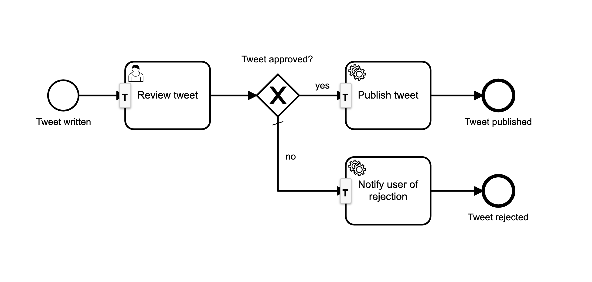

# Twitter QA Process Application

- Implemented in the context of the [Camunda Academy](https://academy.camunda.com) Course [Camunda Platform for Java Developers](https://academy.camunda.com/camunda-platform-java)
- Using Camunda Platform, Springboot and Kotlin
- Inspired by [viadee Unternehmensberatung AG's](https://www.youtube.com/channel/UC1mFlqzB8uaAFxenRmHa13g) video [KOTLIN – PRODUKTIV IM CAMUNDA-KONTEXT](https://www.youtube.com/watch?v=RhIV9Nndl3I):

### The Process:

