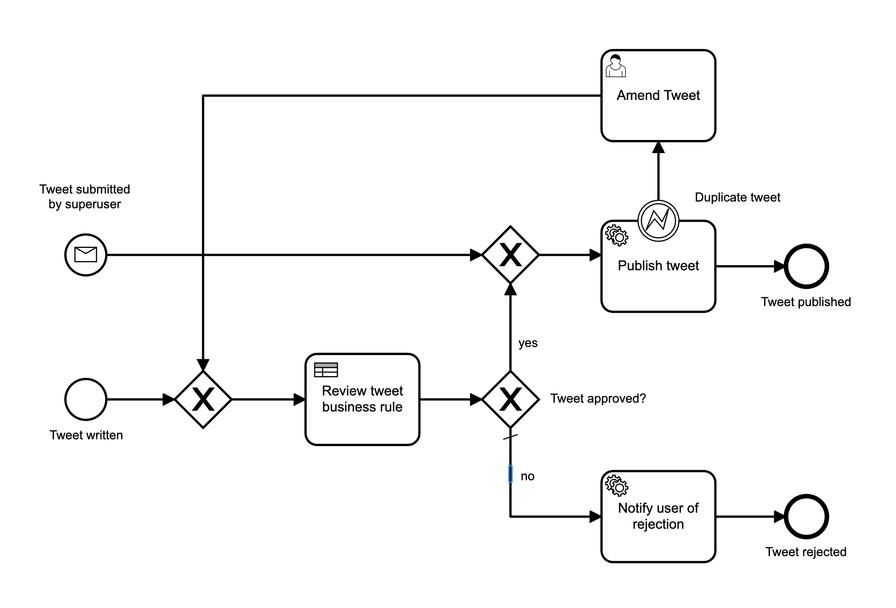

# Twitter QA Process Application

- Implemented in the context of the [Camunda Academy](https://academy.camunda.com) Course [Camunda Platform for Java Developers](https://academy.camunda.com/camunda-platform-java)
- Using Camunda Platform, Springboot and Kotlin
- Inspired by viadee Unternehmensberatung AG's webcast [KOTLIN – PRODUKTIV IM CAMUNDA-KONTEXT](https://www.youtube.com/watch?v=RhIV9Nndl3I)
- Using viadee Unternehmensberatung AG's [Github Repository](https://github.com/viadee/kotlin_camunda_webcast_2021/) as reference

### The Process:

### The Process with business rule:

